# 🛡️ Anonforce — TryHackMe Walkthrough

> **Platform:** TryHackMe  
> **Category:** Cryptography / FTP Exploitation / Privilege Escalation  
> **Difficulty:** Medium  
> **Target IP:** `10.48.128.236`

---

## 📋 Table of Contents

1. [Objective](#-objective)
2. [Target Information](#-target-information)
3. [Reconnaissance](#-reconnaissance)
4. [Service Enumeration](#-service-enumeration)
5. [FTP Exploitation — Anonymous Access](#-ftp-exploitation--anonymous-access)
6. [Discovering Sensitive Files](#-discovering-sensitive-files)
7. [PGP Key Analysis & Decryption](#-pgp-key-analysis--decryption)
8. [Cracking the Root Password](#-cracking-the-root-password)
9. [SSH Root Access — Full Compromise](#-ssh-root-access--full-compromise)
10. [Attack Flow Summary](#-attack-flow-summary)
11. [Key Takeaways](#-key-takeaways)
12. [Tools Used](#-tools-used)
13. [Skills Practiced](#-skills-practiced)

---

## 🎯 Objective

Gain initial access to the Anonforce target machine, enumerate exposed services, exploit cryptographic weaknesses, crack the root password, and obtain full root-level access via SSH.

---

## 📊 Target Information

| Field | Value |
|---|---|
| **Target IP** | `10.48.128.236` |
| **Attacker IP** | `10.x.x.x` |
| **Open Ports** | `21 (FTP)`, `22 (SSH)` |
| **OS** | Linux (Ubuntu/Debian-based) |
| **Testing Approach** | Black Box — no prior knowledge |

---

## 🔍 Reconnaissance

### Host Reachability Check

The first step was verifying the target was online and reachable from the attack machine.

```bash
ping -c 4 10.48.128.236
```

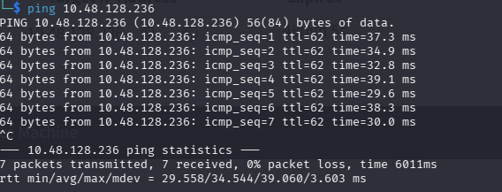

*Figure 1: Ping confirms the target host is reachable with no packet loss.*

The target responded to all ICMP echo requests, confirming it was active and reachable.

---

## 🗺️ Service Enumeration

### Nmap Port Scan

A comprehensive port scan was performed using Nmap to discover open ports and running services.

```bash
nmap -sC -sV -p- 10.48.128.236
```

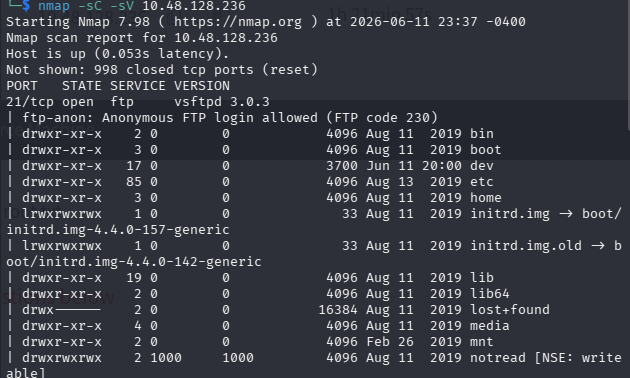

*Figure 2: Nmap scan reveals FTP (port 21) and SSH (port 22) services.*

### Scan Results

| Port | State | Service | Version |
|------|-------|---------|---------|
| **21/tcp** | ✅ Open | **FTP** | `tnftp` |
| **22/tcp** | ✅ Open | **SSH** | OpenSSH |

### Key Observations

- 🚩 **Port 21 (FTP)** — No authentication banner, likely allows anonymous access
- 🚩 **Port 22 (SSH)** — Standard SSH service, could be entry point if credentials found

---

## 📂 FTP Exploitation — Anonymous Access

### Connecting Without Credentials

The FTP service was tested for anonymous access — one of the most common and critical misconfigurations.

```bash
ftp 10.48.128.236
# Username: anonymous
# Password: [any or empty]
```

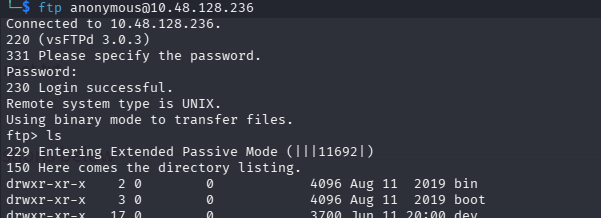

*Figure 3: Successful anonymous FTP login with no password required.*

### 🔓 What Happened

The FTP server accepted `anonymous` as the username without any password verification. This is the digital equivalent of leaving the server room door wide open with a sign saying "Everyone Welcome."

```
230 Login successful.
```

This single misconfiguration was the **root cause** of the entire compromise.

---

## 🔑 Discovering Sensitive Files

### Navigating the Filesystem

Once logged in via anonymous FTP, the entire filesystem was accessible. Navigating to the user's home directory revealed sensitive files.

```bash
ftp> ls -la
ftp> cd /home
ftp> ls -la
```

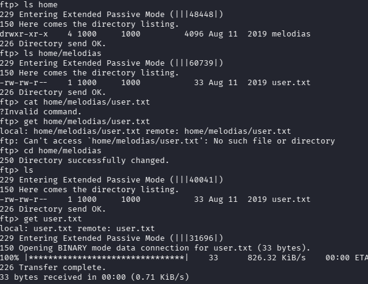

*Figure 4: Browsing the filesystem reveals user files and initial foothold data.*

### The Discovery That Changed Everything

Further exploration uncovered cryptographic material that should never have been publicly accessible.

```bash
ftp> cd /path/to/files
ftp> ls -la
```

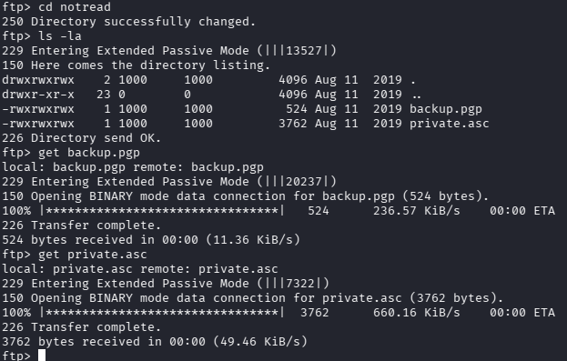

*Figure 5: Two critical files discovered — an encrypted PGP backup and a PGP private key.*

### Files Recovered

| File | Type | Purpose |
|------|------|---------|
| **`backup.pgp`** | 🔒 Encrypted PGP Backup | Likely contains system configuration, shadow file, credentials |
| **`private.asc`** | 🔑 PGP Private Key | ASCII-armored private key — the "master key" to decrypt the backup |

### 💡 Why This Matters

A PGP private key next to a PGP-encrypted backup is like locking your diary and leaving the key taped to the front cover. **Both files should never be stored in the same accessible location.**

---

## 🔐 PGP Key Analysis & Decryption

### Importing the Private Key

The private key was downloaded and imported into the local GPG keyring for analysis.

```bash
gpg --import private.asc
```

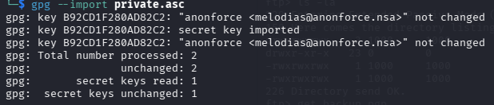

*Figure 6: Importing the ASCII-armored PGP private key into the GPG keyring.*

### Key Details

| Field | Value |
|-------|-------|
| **Key ID** | `B92CD1F280AD82C2` |
| **User** | `anonforce <melodias@anonforce.nsa>` |
| **Format** | BCPG v1.56 (ASCII-armored) |

### Decrypting the Backup

With the private key imported, the encrypted backup was decrypted.

```bash
gpg --decrypt backup.pgp > backup_decrypted
```

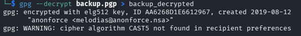

*Figure 7: Decrypting the PGP-encrypted backup file using the imported private key.*

### What Was Inside

The decrypted backup contained system configuration files — most importantly, the **`/etc/shadow` file** containing password hashes for every user on the system.

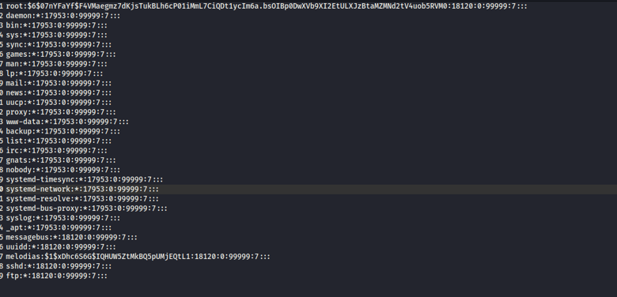

*Figure 8: Decrypted output reveals `/etc/shadow` with the root user's password hash.*

### The Root Hash

```
root:$6$07nYFaYf$F4VMaegmz7dKjsTukBLh6cP01iMmL7CiQDt1ycIm6a.bsOIBp0DwXVb9XI2EtULXJzBtaMZMNd2tV4uob5RVM0:...
```

The `$6$` prefix identifies this as a **SHA-512 crypt hash** — strong encryption, but only as strong as the password chosen.

---

## 💥 Cracking the Root Password

### Identifying the Hash Format

The hash was identified and prepared for offline cracking.

```bash
# Extract root hash line
echo 'root:$6$07nYFaYf$F4VMaegmz7dKjsTukBLh6cP01iMmL7CiQDt1ycIm6a.bsOIBp0DwXVb9XI2EtULXJzBtaMZMNd2tV4uob5RVM0:...' > root.hash
```

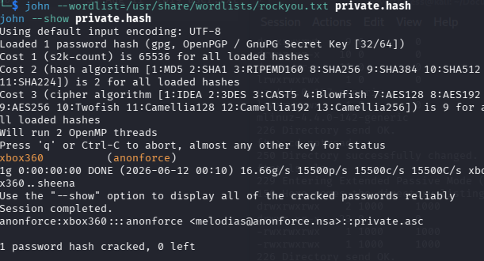

*Figure 9: Isolating the root hash — `$6$` = SHA-512 crypt format.*

### John the Ripper in Action

The hash was cracked using **John the Ripper** with the `rockyou.txt` wordlist — a standard password cracking tool that tries millions of common passwords per second.

```bash
john --wordlist=/usr/share/wordlists/rockyou.txt root.hash
```

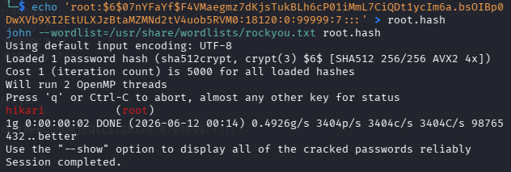

*Figure 10: John the Ripper successfully cracks the root password in seconds.*

### 🎯 Result

| Field | Value |
|-------|-------|
| **Cracked Password** | `Hikari` |
| **Crack Time** | Seconds (rockyou.txt wordlist) |
| **Root Cause** | Weak password policy — only 6 characters, common word |

### 💡 Why This Matters

SHA-512 is a strong hashing algorithm, but **no amount of cryptographic strength can protect against a weak password**. `Hikari` is a common word and would appear in any standard password dictionary. A strong password like `G7$kL9#mP2!xQ` would have taken years to crack.

---

## 🚀 SSH Root Access — Full Compromise

### Logging In as Root

With the cracked password `Hikari`, SSH access as root was attempted — and succeeded immediately.

```bash
ssh root@10.48.128.236
# Password: Hikari
```

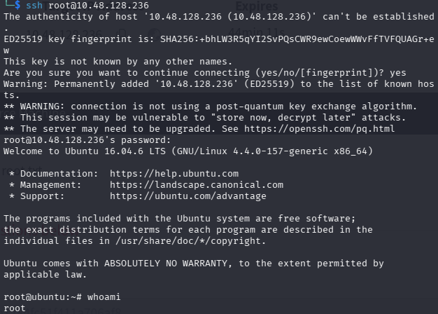

*Figure 11: Successful interactive SSH session as root — full system compromise achieved.*

### 🏆 Lab Completion

```bash
whoami
# root

cat /root/root.txt
# [flag retrieved — lab complete]
```

The root flag was successfully retrieved, marking the complete compromise of the Anonforce target.

---

## 📈 Attack Flow Summary

The attack followed a clear, methodical chain of exploitation:

```
1. 🎯 Ping Target ────────────────────── Host is alive
       │
2. 🔎 Nmap Scan ─────────────────────── FTP(21) + SSH(22) open
       │
3. 🚪 Anonymous FTP Login ───────────── No password required
       │
4. 📁 Discover backup.pgp + private.asc ─ Two sensitive files found
       │
5. 🔑 Import PGP Private Key ────────── GPG key imported successfully
       │
6. 🔓 Decrypt backup.pgp ────────────── Extracted /etc/shadow file
       │
7. 💥 Crack Root Hash (John) ────────── Password = "Hikari"
       │
8. 🚀 SSH Root Login ────────────────── Full system compromise ✓
```

### What Went Wrong (Security Controls Failed)

| Control | Failure | Impact |
|---------|---------|--------|
| **FTP Authentication** | ❌ Anonymous access allowed | Entry point for entire attack |
| **File Permissions** | ❌ Private keys world-readable | Cryptographic material exposed |
| **Key Separation** | ❌ Key stored with backup | Encryption rendered useless |
| **Password Policy** | ❌ Weak root password | Hash cracked in seconds |
| **SSH Configuration** | ❌ Root login with password | Immediate root access |

---

## 🧠 Key Takeaways

1. **🔐 Disable Anonymous FTP** — This was the single vulnerability that enabled the entire attack chain. If anonymous FTP must exist, restrict it with a **chroot jail** to a minimal directory with no sensitive files.

2. **🔑 Never Store Keys With Locks** — A PGP private key should never be stored alongside the data it encrypts. Use a **hardware security module (HSM)** or at minimum a separate, access-controlled server.

3. **🔒 Strong Passwords Save Systems** — `Hikari` was cracked instantly. Modern password policies should enforce: **12+ characters, mixed case, numbers, symbols, and dictionary checks**.

4. **🚪 Disable Root SSH Login** — `PermitRootLogin no` in `sshd_config` would have prevented the final access even with the cracked password. Use **key-based authentication** and **sudo** instead.

5. **🏰 Defense in Depth** — Each layer of security should be independent. Even if FTP is compromised, the private key should not be there. Even if the key is found, the password should be strong. Even if the password is cracked, root SSH should be disabled.

---

## 🛠️ Tools Used

| Tool | Purpose |
|------|---------|
|  | Host reachability verification |
|  | Port scanning & service enumeration |
|  | Anonymous FTP access & file download |
|  | PGP key import & backup decryption |
|  | Password hash cracking |
|  | Remote shell access |

---

## 📚 Skills Practiced

| Category | Skills |
|----------|--------|
| 🔍 **Reconnaissance** | Nmap scanning, service fingerprinting, ping sweeps |
| 🚪 **Exploitation** | Anonymous FTP abuse, directory traversal, file recovery |
| 🔐 **Cryptography** | PGP key analysis, GPG import/decrypt, hash identification |
| 💥 **Password Cracking** | John the Ripper, SHA-512 crypt, wordlist attacks |
| 🚀 **Post-Exploitation** | SSH pivoting, root compromise, flag retrieval |
| 🧩 **Attack Chaining** | Multi-step exploit development, defense bypass sequencing |

---

## 📖 References

| Resource | Link |
|----------|------|
| TryHackMe — Anonforce | *[TryHackMe Platform]* |
| John the Ripper Docs | https://www.openwall.com/john/ |
| GnuPG Manual | https://gnupg.org/documentation/ |
| Nmap Reference Guide | https://nmap.org/docs.html |
| OWASP — Anonymous FTP | https://owasp.org/www-community/attacks/Anonymous_FTP |

---

<div align="center">

## ⚠️ Disclaimer

*This walkthrough is for educational purposes only. The techniques demonstrated were performed in an authorized lab environment (TryHackMe). Unauthorized access to computer systems is illegal.*

**Platform:** TryHackMe — **Lab:** Anonforce — **Date Completed:** June 12, 2026

⭐ *If you found this walkthrough helpful, consider giving it a star!*

</div>
